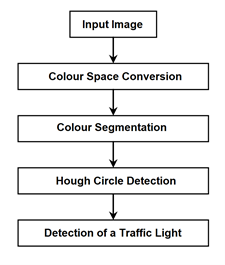
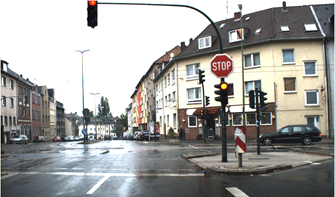
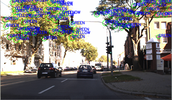

# Hough Circle Transform Traffic Light Detection and Recognition

The trend of autonomous vehicles is increasing as electric vehicles become more readily available. Autonomous vehicles use computer vision techniques to detect and recognize road markings and traffic signs. Traffic lights serve as indicators to control the movement of traffic. Without proper identification and classification of traffic lights, autonomous cars would not be able to navigate through traffic safely. The resulting technique may be used to guide autonomous vehicles or act as a safety feature for non-autonomous vehicles; human drivers can be alerted when a traffic light changes. This study explores using the combination of color segmentation and Hough circle detection to detect and recognize traffic lights.

## Literature Review

In this literature review, we examine and compare the various techniques currently available to detect and recognize traffic lights. Focus is given to image processing techniques over machine learning or artificial intelligence techniques.

### Real-time Traffic Light Recognition on Mobile Devices with Geometry-Based Filtering

Sung &amp; Tsai [1] demonstrates a real-time method of recognizing traffic lights. They utilize a color thresholding and geometry-based filtering as it is computationally cheap which allows the solution to run on mobile devices which typically have lower performance CPUs compared to desktop computers.

The author proposes a method where the probability of each pixel of the input image being part of a red, green or yellow light is calculated using color thresholding. Individual blobs are grown using 8-connectivity to merge small blobs as a whole.

Blobs larger than a predetermined pixel size will be filtered out as they are unlikely to be a traffic light. Finally, using previous and consecutive frames, temporal information is used to calculate the trajectory of the traffic light and filter out false candidates.

This method is efficient as it is computationally fast enough to be run on mobile devices. However, it would not work on static images as the geometry cannot be calculated.

### Efficient Traffic Light Detection for Autonomous Vehicles

Karkoub &amp; Saripalli [2] demonstrates an efficient method of detecting traffic lights specifically for autonomous vehicles. They used an algorithm based on XGBoost. Running at 13 FPS, this technique would process input data in 77 milliseconds which is fast enough to be considered as real-time despite the authors not claiming it as such. Since the paper focuses on autonomous vehicles, safety precautions would require an even quicker turnaround time as a slight delay might cause death or injury. Perhaps this is the reason the authors refuse to claim it as real-time.

The median filter was deemed most appropriate to de-noise the image during pre-processing since it was much faster while not affecting the results. The color space was converted from RGB to HSV because the latter performs better under varying lighting conditions. Since chroma (color information) is separated from luma (luminosity information), the illumination of the active traffic light is more obvious and easier to be detected in the HSV color space.

Color segmentation is then used to extract the region of interest which in this case is the illuminated light. Due to the inconsistent color of traffic lights in the real-world, morphological operations must be applied to fill gaps produced after color segmentation. A simple morphological closing was found to be sufficient, by first dilating then eroding the segmented image.

The author used a blob detection technique proposed by Suzuki &amp; Abe (1985) which was much faster than competing techniques for larger blobs (traffic lights at closer proximity to the camera).

### Traffic Light Detection with Color and Edge Information

Omachi &amp; Omachi [3] proposes an image-based solution that is both quick and robust. First, they convert the color space captured by an in-vehicle camera from RGB to normalized RGB. The reason behind this is to reduce the effect of uneven or varying illumination during processing. After converting the color space, candidate regions are selected by choosing pixels based on their color. A narrow range of red, yellow, and green pixels are selected as they are very likely to represent the information of a traffic light. To detect the traffic light, Hough transform is used because the shape of the traffic light is known to be a circle. Sobel filter is used to detect edges, the authors did not specify the reason why. Alternatives such as canny edge detection is likely to work just as well. Their implementation for the Hough transform is modified to reduce computational complexity which will make the detection process more stable. The results gathered that the algorithm works well and is 87% accurate. They created their own dataset by taking pictures of traffic light from the inside of a moving car. I consider this implementation of traffic light detection to be the best in terms of complexity vs accuracy ratio, it is simple yet functional. Other implementations use machine learning or other complex methods which is out of my scope to be recreated.

### Real-Time Traffic Light Detection with Adaptive Background Suppression Filter

Shi et al. [4] proposes a novel method of traffic light detection where their candidate extraction stage relies on suppressing the background. Usually, most methods begin by locating the foreground (traffic light) and ignoring the background. This implementation uses the opposite approach where the background is suppressed which enhances the ability of the algorithm to detect the foreground. For the recognition stage, they verify the candidate regions by classifying them based on semantic classes.

### Traffic Light Recognition using Image Processing Compared to Learning Processes

Charette &amp; Nashashibi [5] proposes a method where the image is processed in grayscale. Most other methods exploit the color of traffic lights (Red, yellow, and green) to detect and recognize them. In this paper, spot light detection is used instead. Once detected, generic adaptive templates are used to recognize the traffic light signal. Since the process is done modularly, their algorithm works in different countries that employ different style traffic lights without issue. Based on testing on videos sourced from three countries: USA, France, and China, the algorithm produced good results with minimal incorrect detections. The algorithm was able to run real-time.

### Conclusion

Overall, most methods are able to run in real-time. All techniques discussed except [5] employ color based processing. The majority of algorithms are image based and do not use machine learning with the exception of one paper. Based on the information gathered, I have decided to recreate Omachi &amp; Omachi&#39;s[3] solution as it is within my scope in terms of difficulty.

## Proposed Method

_Figure 1. Data flow diagram of the proposed method._

### 1. Convert color space

Photos captured of traffic lights often have the sky and buildings in the background which results in varying illumination throughout the image. Besides, if the images are extracted from a video, auto exposure settings might cause the brightness to dramatically change from frame to frame. First, start by converting the input image to HSV color-space as it is more robust to illumination changes [3].

### 2. Extract color information

Next, extract Red, green, and yellow color information as they represent the 3 colors used in standard Traffic Lights. This is done by manually selecting a range that represents traffic light colors and then applying it as a mask.

### 3. Extract circles

Then, use Hough Circle Transform to find circles since standard traffic light faces are round in shape.

### 4. Classify regions

Finally, classified regions that satisfy shape criterion are then detected as traffic light signals based on color values.

## Experiment

To test the accuracy and performance of the proposed algorithm, an experiment was conducted where 20 images depicting traffic lights were selected and fed into the system.

The images were sourced from [6], which is a benchmark designed for traffic signs in Germany. Although not intended for the purpose of testing traffic lights, since the images are captured from the dashboard of a moving car, the full images contain a full view which includes visible traffic lights which makes this dataset applicable for this paper.

Do note that there are only 2 images that represent yellow traffic lights in the testing data set. This is because traffic lights spend the most time either in the Green or Red state. The Yellow state is very brief. For this reason, the vehicle used to collect the dataset did not see Yellow very much which results in fewer frames of yellow traffic lights collected. This is accounted for by applying a weightage to the recall value.

The program will accept the images as input, label the guesses of the location of the traffic light and the associated color and then output an image with the guessed overlaid on it.

True positives is when the program predicts the traffic light state correctly. False negative is when the program fails to predict a traffic light state. The recall or also known as sensitivity is calculated by dividing the true positives by sum of true positives and false negatives. This represents how often the program predicts correctly without accounting for false negatives.

## Results

|| Red | Green | Yellow |
| --- | --- | --- | --- |
| Images | 9 | 10 | 1 |
| True Positive | 6 | 13 | 1 |
| False Negative | 12 | 8 | 1 |
| Recall | 33.33% | 61.90% | 100.00% |
| Weighted Recall | 15% | 31% | 0.5% |
| Overall Recall | 46.50% |

_Table 1. Recall rate separated by traffic light colour._

The proposed method performs poorly where it often fails to detect a traffic light. This is due to the nature of the input images. The colour rendition is poor where colours like Yellow and Red are too similar, making it difficult for the colour segmentation process to distinguish between the two possible states.

_Figure 2. Test image where a traffic light (right) in the state of Red appears yellow._

Besides that, since this method uses hough circle transform, it is expected for the traffic light lamps to be round in shape. In practice, many of the test images depict traffic lights that are not perfectly round. Due to the failure of lighting elements or narrow dynamic range of camera, the lamp appears as odd shapes that cannot be detected by the algorithm.

_Figure 3. Test image where trees are present._

In images where there are trees or leaves, the green colour associated confuses the colour segmentation attempting to extract green traffic lights. Depending on the season, the leaves may appear as yellow-ish which would then in turn affect yellow traffic lights detection.

## Conclusion

This paper proposes a method to detect and recognize traffic lights present in an image. This is done by converting the colour space of the input image, applying colour segmentation based on the three possible stats of a traffic light, and finally applying Hough circle detection to locate the traffic light.

Preliminary results from the experiment show that this method performs poorly in real-life scenarios where the images used captured colours inaccurately and contain noise from natural objects such as trees. To improve the algorithm, other methods such as histogram of oriented gradients could be applied to first isolate the traffic light from the image before attempting state recognition in order to reduce noise. The location of the lamp in relation to the bounding box could be factored in to detect the state instead of relying on just the colour which may vary significantly from image to image.

## References
| No. | Citation |
| --- | --- |
| [1] | T.-P. Sung and H.-M. Tsai, &quot;Real-time traffic light recognition on mobile devices with geometry-based filtering,&quot; _Seventh International Conference on Distributed Smart Cameras (ICDSC), Palm Springs,_ pp. 1-7, 2013. |
| [2] | W. Karkoub and S. Saripalli, &quot;Efficient Traffic Light Detection for Autonomous Vehicles,&quot; _Proceedings of the 5th International Symposium on Future Active Safety Technology toward Zero Accidents,_ 2019. |
| [3] | M. Omachi and S. Omachi, &quot;Traffic light detection with color and edge information,&quot; _2nd IEEE International Conference on Computer Science and Information Technology,_ pp. 284-287, 2009. |
| [4] | Z. Shi, Z. Zou and C. Zhang, &quot;Real-Time Traffic Light Detection With Adaptive Background Suppression Filter,&quot; _IEEE Transactions on Intelligent Transportation Systems,_ pp. 690-700, 2016. |
| [5] | R. d. Charette and F. Nashashibi, &quot;Traffic light recognition using image processing compared to learning processes,&quot; _IEEE/RSJ International Conference on Intelligent Robots and Systems,_ pp. 333-338, 2009. |
| [6] | J. Stallkamp, M. Schlipsing, J. Salmen and C. Igel, &quot;Man vs. computer: Benchmarking machine learning algorithms for traffic sign recognition,&quot; _Neural Networks,_ vol. 32, pp. 323-332, 2012. |
| [7] | P. Windridge, &quot;OpenCV + Python Traffic Light Recognition,&quot; 19 February 2018. [Online]. Available: https://github.com/ptd006/redlightdetection. |

## Dependencies

1. Python 3.7.7
2. OpenCV 4.2.0
3. Numpy 1.18.1

## Instructions

1. Plug in a webcam or start a virtual webcam device, streaming the video or still frame of your choice as input.
2. Execute 'Source Code.py' either via an IDE of your choice or using the 'python' interpreter via command-line.
3. Use the sliders to adjust parameters for a better result.
